# Introduction 
TODO: Intro

# Setup Service Connection
To use this Pipeline create a Service Connection to Authenticate to your Dynamics Environment.

## Create App Registration
Create a new App Registration for your DevOps Pipeline
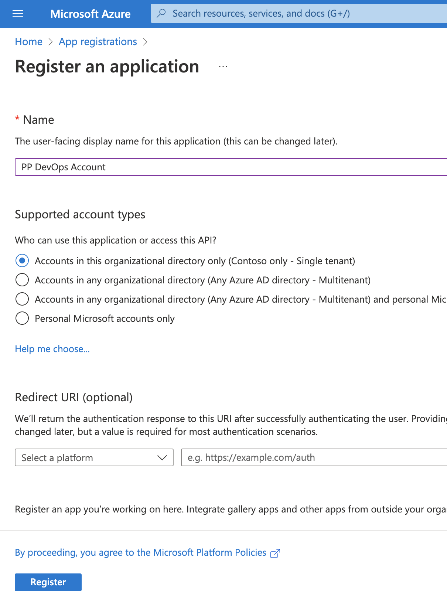
Create a Secret for the App
You will need this Secret in a future step.
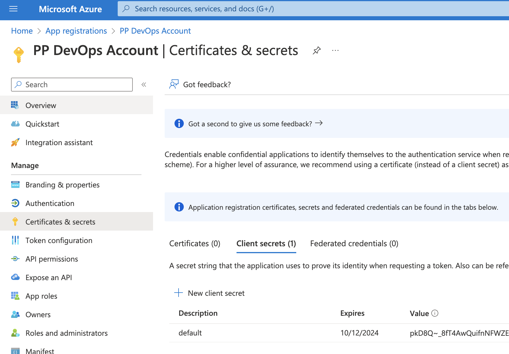
Notice the App informations for the App you will need the Tenant ID and the App ID.
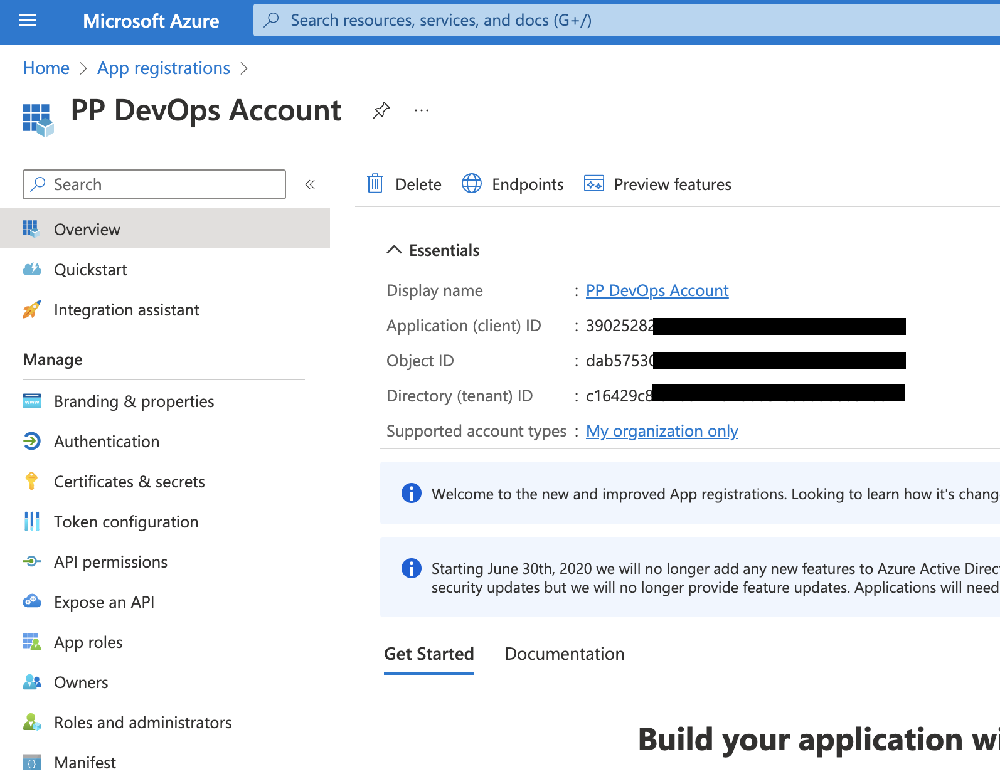

## Authorize App in Dynamics
Authorize the App in the Power Apps Admin Center
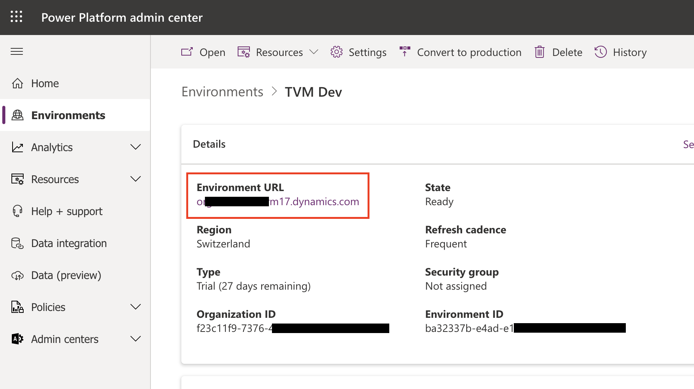
Notice the Environment Link, you will need it in a future Step.

Add a New Application User to the Environment
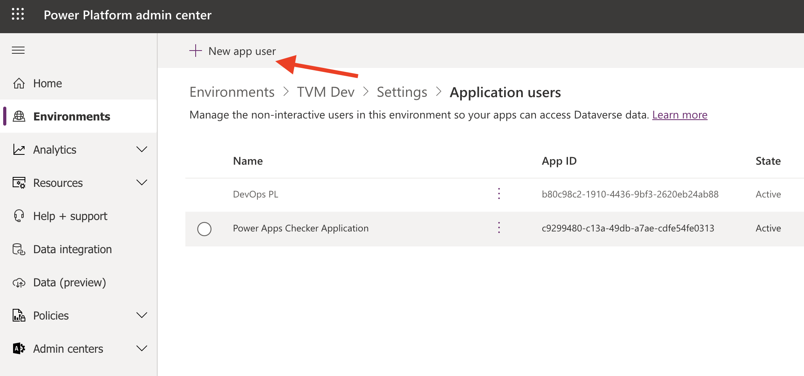

Add your created App - search if necessary with the App ID
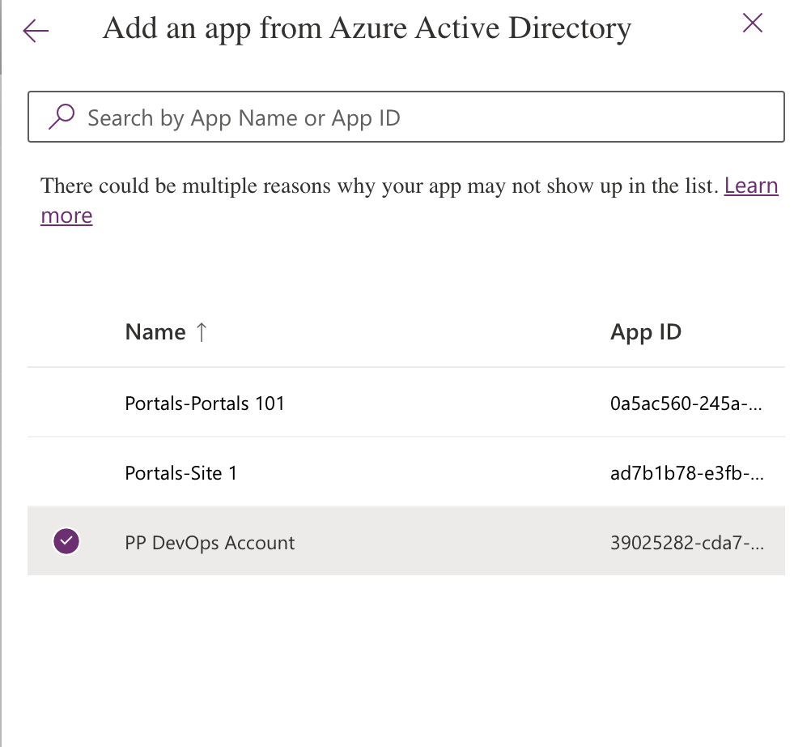

Give your app the System Administrator Security Role.
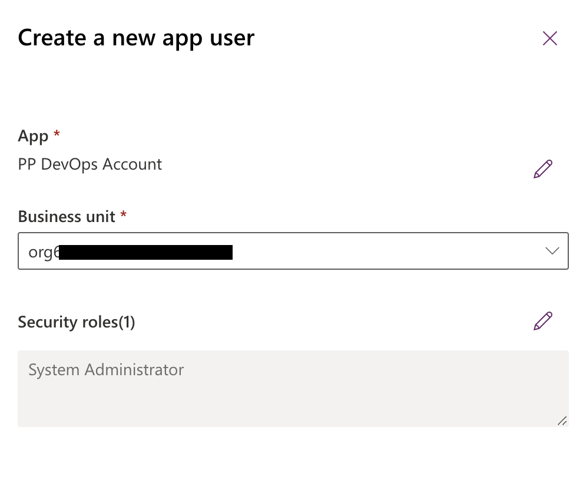

## Create Service Connection
Configure a new Service Connection in Azure DevOps
Go to the Project Settings and add a new Service Connection
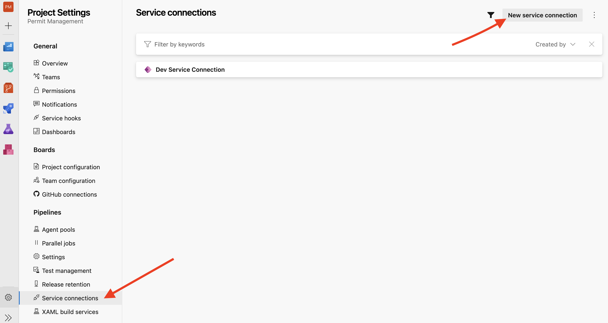
Select Type Power Platform
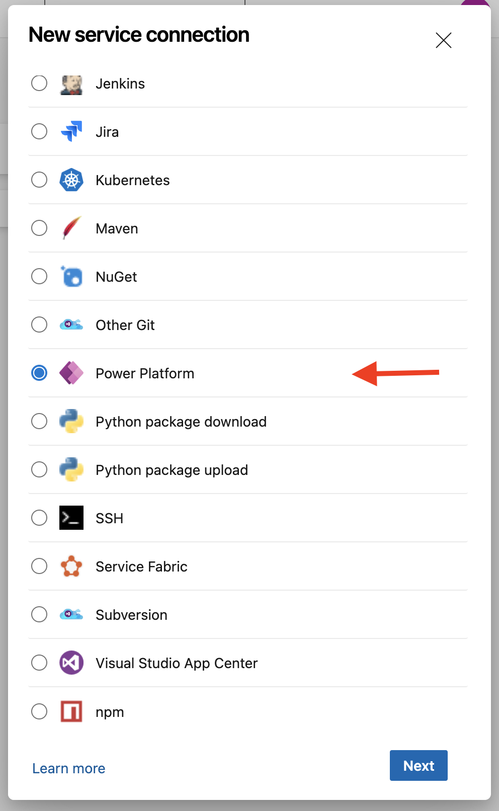
Fill in the information from the previous steps
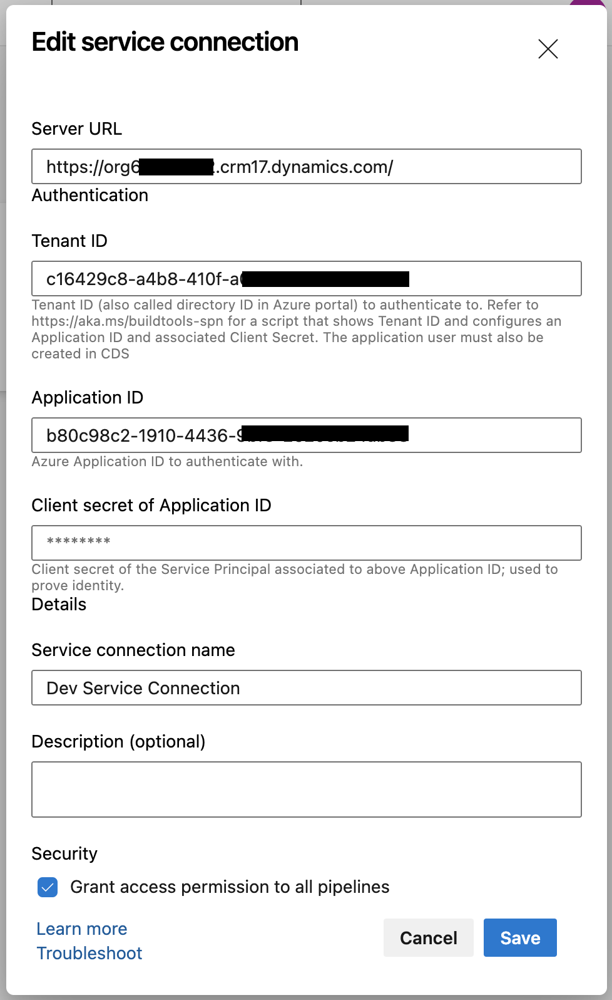
And Save

# Configure Pipeline

Complete the Variables Part in the Pipeline with your Values.
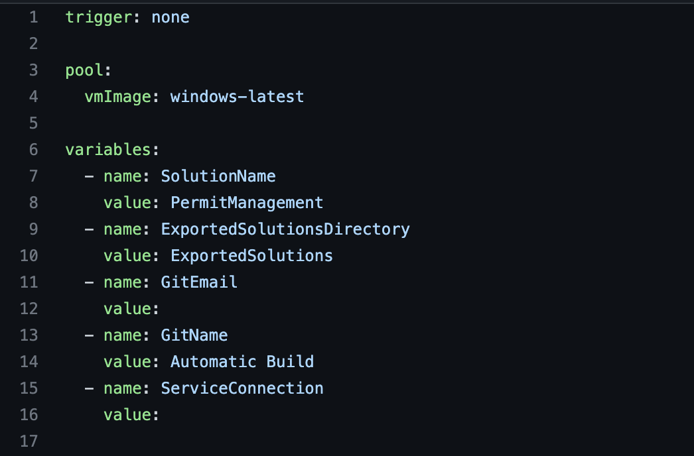

In your Project go to Pipelines -> Pipelines -> New Pipeline
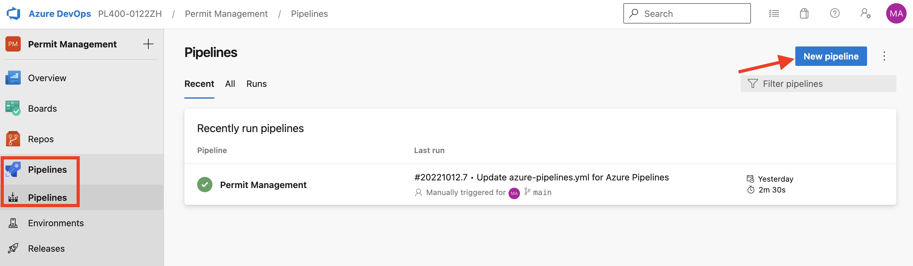

Select Azure Repos (Git)
Choose from existing file and select your Pipeline
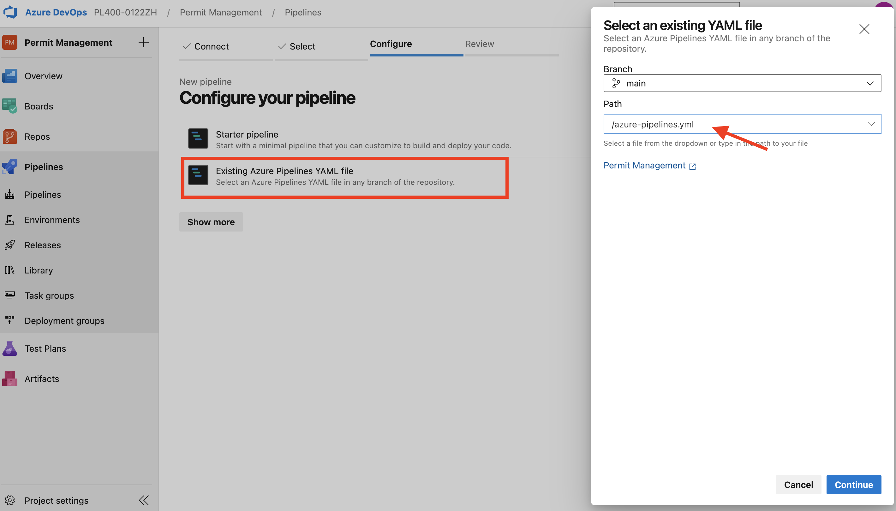

RUN it :)

